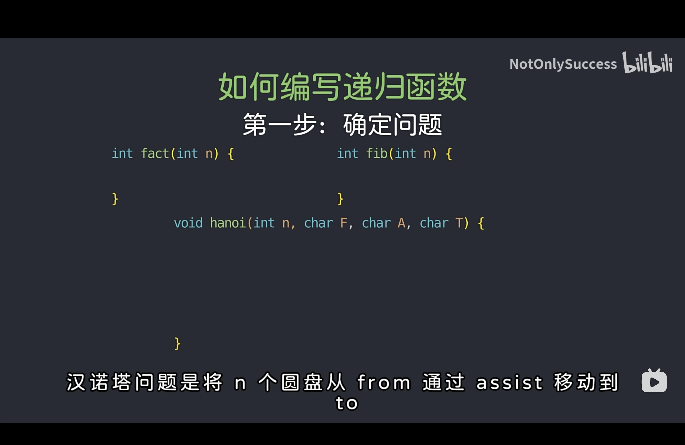
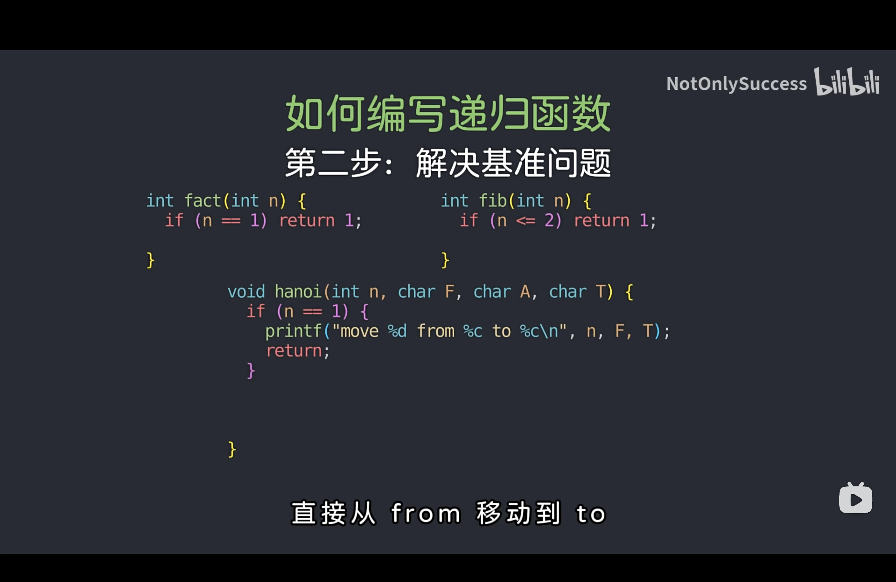
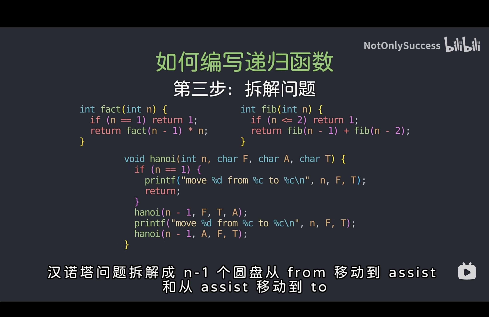

# 递归算法的理解

## 如何写一个递归算法

1. **确定问题**：给当前的算法一个符合计算机处理流程的解释。例如对于斐波那契数数列求解`int fib(int n)`，应该翻译成计算数列第n项并返回数列的值



2. **解决基准问题**：思考当输入值为基础值时，其返回的结果是什么。该步用于**确定递归终止条件**。例如对于汉诺塔问题，在只有一块积木时只需要将其从From移到Target即可



3. **拆解问题**：考虑在当前的普通输入时，应该如何解决问题。例如对于斐波那契数数列求解，当前应该返回的值是`fib(n-1)+fib(n-2)`。

   ❗️❗️**不要尝试去思考其内部具体是如何执行的，只要把当前函数当作一个已经实现的库函数即可。否则只会越绕越晕。**



## 递归算法举例分析

### 二叉树遍历

1. **确定问题**：遍历以root为根结点的二叉树
2. **解决基准问题**：当root为空指针时返回
3. **拆解问题**：在访问完当前结点后，继续遍历左子树（具体说：遍历以root->left为根结点的二叉树），继续遍历右子树（具体说：遍历以root->right为根结点的二叉树）

```c++
// 二叉树的遍历框架
void traverse(TreeNode* root) {
    if (root == nullptr) {
        return;
    }
  	cout << root->val<<endl;
    traverse(root->left);
    traverse(root->right);
}
```


### 二叉树的最大深度

1. **确定问题**：计算以root为根结点的二叉树的最大深度并返回最大深度
2. **解决基准问题**：当root为空指针时，表示该树空，返回0
3. **拆解问题**：当前结点的最大深度即为左右子树中的最大深度+1，所以只需要获取左右子树的最大深度后+1即可

```c++
// 定义：输入根节点，返回这棵二叉树的最大深度
int maxDepth(TreeNode* root) {
    if (root == nullptr) {
        return 0;
    }
    // 利用定义，计算左右子树的最大深度
    int leftMax = maxDepth(root->left);
    int rightMax = maxDepth(root->right);
    // 整棵树的最大深度等于左右子树的最大深度取最大值，
    // 然后再加上根节点自己
    int res = std::max(leftMax, rightMax) + 1;

    return res;
}
```


### 在二叉搜索树中插入结点

1. **确定问题**：在root为根结点的二叉树中插入值为val的结点，返回root的根结点
2. **解决基准问题**：当root为空指针时，表示该树空，插入新结点
3. **拆解问题**：如果当前结点非空，那就表示待插入结点应该在左或右子树，那如果`root->val>val`则在左子树中插入，如果`root->val<val`则在右子树中插入，并且返回值为当前子树的根结点（不用管插入的具体位置，以及是否为`root->left`或`root->right`，要想的只是把已经修改好的树返回给左右孩子指针），最后返回根结点`root`

```C++
// 在root为根的树中插入值为val的结点，并返回root
TreeNode* insertIntoBST(TreeNode* root, int val)
{
    if (root == NULL)
    {
        TreeNode *new_node = new TreeNode(val);
        return new_node;
    }

    if (root->val>val)
        root->left = insertIntoBST(root->left, val);
    else if  (root->val<val)
        root->right = insertIntoBST(root->right, val);

    return root;
}
```
